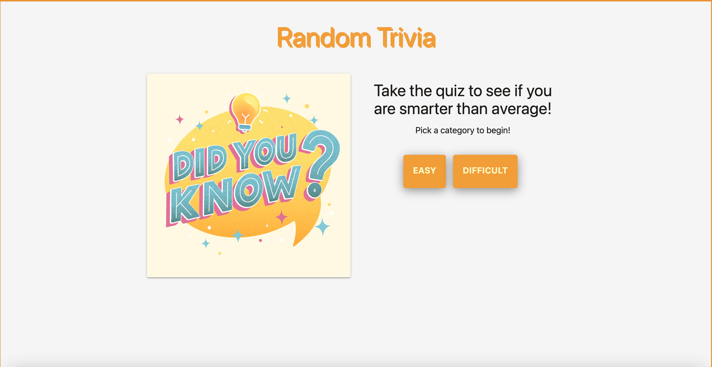

# Group_3
In this group project, We are building a Science , Nature and Jeopardy trivia game for a user who wants to test their trivia skills. It will feature two categories one for science and one that features questions from jeopardy.

The group project is structured with assets folder, index.html, README.md , and script.js. Within the assets folder, there is also a style.css folder that contains CSS. 

Live URL via github pages: 

Screenshot of Science Nature and Jeopardy Trivia Quiz:
